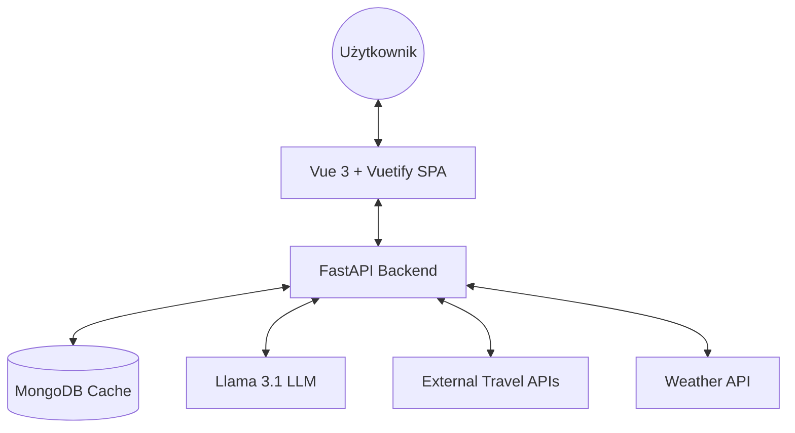
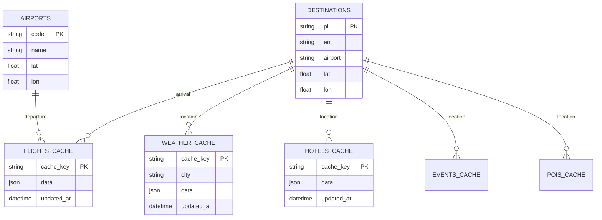

# 🌍 Smart Travel Planner AI
[](https://github.com/WukerDev/Smart-Travel-Planner/actions)

Nowoczesna aplikacja webowa do kompleksowego planowania podróży, wspierana przez lokalne modele wielkojęzyczne (LLM) oraz integrację z zewnętrznymi API turystycznymi.

---

## 🚀 Kluczowe Funkcjonalności
* **AI Itinerary Generator:** Generowanie spersonalizowanych planów zwiedzania (Llama 3.1 via Ollama).
* **Live Flight & Hotel Search:** Integracja z RapidAPI (Sky Scrapper & Booking.com).
* **Interactive Mapping:** Wizualizacja tras lotów i atrakcji (POI) przy użyciu OpenLayers.
* **Real-time Weather:** 5-dniowa prognoza pogody dla wybranej destynacji.
* **AI Travel Assistant:** Interaktywny czat z asystentem podróży działający w 100% lokalnie.
* **Modern UI/UX:** Responsywny interfejs z trybem Dark/Light mode i efektami szklanymi (Glassmorphism).

## 🛠 Stos Technologiczny
### Frontend
* **Vue 3** (Composition API) + **Vite**
* **Vuetify 3** (Material Design Component Library)
* **Pinia** (State Management)
* **OpenLayers** (Mapy wektorowe)

### Backend
* **FastAPI** (Python 3.11+)
* **MongoDB** + **Motor** (Asynchroniczny sterownik bazy danych)
* **Ollama** (Lokalne hostowanie modelu Llama 3.1)
* **Pytest** (Automatyczne testy jednostkowe i integracyjne)

### DevOps & Infrastructure
* **Docker & Docker Compose** (Konteneryzacja usług)
* **GitHub Actions** (Automatyczny pipeline CI/CD)
* **GHCR** (GitHub Container Registry dla obrazów Dockera)

## 🏗 Architektura Systemu i Środowisko
Aplikacja opiera się na klasycznej architekturze klient-serwer i jest w pełni konteneryzowana przy użyciu **Dockera**. Środowisko uruchomieniowe składa się z trzech głównych serwisów:

1. **Frontend (Vue 3 + Pinia):** Aplikacja SPA (Single Page Application). Głównym punktem wejścia interfejsu jest `App.vue`. Logika biznesowa po stronie klienta i komunikacja z API została zorganizowana w modularne store'y (Pinia).
2. **Backend (FastAPI):** Serwer REST API napisany w Pythonie (`main.py`). Pełni rolę warstwy pośredniczącej (BFF - Backend for Frontend) oraz orkiestratora. Zajmuje się logiką biznesową, komunikacją z zewnętrznymi API (np. pogodą, lotami), komunikacją z lokalnym modelem sztucznej inteligencji (Ollama) oraz bazą danych.
3. **Baza Danych (MongoDB):** Nierelacyjna baza danych wykorzystywana do przechowywania słowników (lotniska, dostępne destynacje) oraz cachowania zapytań zewnętrznych (np. wyników lotów, pogody), aby zminimalizować zużycie zewnętrznych limitów API.






## 🧠 Zarządzanie Stanem i Logika Frontendowa
Sercem logiki po stronie przeglądarki są moduły store zrealizowane w bibliotece **Pinia**. Oddzielają one warstwę wizualną od logiki pobierania danych. Główne moduły to:

* **`ai.ts`**: Zarządza interakcją ze sztuczną inteligencją (czat i generowanie Itinerary).
* **`flights.ts` & `hotels.ts`**: Moduły odpowiedzialne za wyszukiwanie połączeń lotniczych oraz obiektów noclegowych.
* **`weather.ts`**: Pobiera i przechowuje aktualną prognozę pogody.
* **`extras.ts`**: Obsługuje pobieranie lokalnych atrakcji turystycznych (POI) oraz wydarzeń.
* **`locations.ts`**: Zarządza słownikami systemowymi pobieranymi przy starcie aplikacji.

## 🔌 Główne Endpointy API (Backend)
Backend w FastAPI (`main.py`) wystawia czytelne API dla frontendu:
* `POST /api/chat` - Komunikacja z asystentem podróży (LLM).
* `GET /api/itinerary` - Generowanie zarysu wycieczki przez AI.
* `GET /api/flights` & `GET /api/hotels` - Pobieranie danych (wspierane przez cache MongoDB).
* `GET /api/weather/{city}` - Pobieranie danych pogodowych.
* `GET /api/airports` & `GET /api/destinations` - Endpointy zasilające słowniki.

*Uwaga: Przy starcie kontenera, backend automatycznie weryfikuje stan bazy danych i inicjalizuje ją danymi początkowymi z pliku `data.json`.*

## 🎨 Interfejs Użytkownika i Struktura Widoków
Aplikacja została zaprojektowana z myślą o nowoczesnym wyglądzie, ergonomii (UI/UX) oraz płynnych przejściach stanu:

### Podział Ekranu i Układ (Split-Layout)
Główny widok wyszukiwarki (`index.vue`) opiera się na dynamicznym układzie dwukolumnowym:
* **Prawy Panel (Wyszukiwarka):** Wykorzystuje efekt szkła (**Glassmorphism**). Zawiera formularz do określania parametrów podróży.
* **Lewy Panel (Prezentacja / Wyniki):** W stanie początkowym pełni rolę ekranu powitalnego (Hero Section) z dynamicznym tłem. Po wyszukaniu lotu płynnie transformuje się w **System Zakładek (Tabs)**, kategoryzując wyniki na cztery sekcje: *Trasa & Plan*, *Loty i Hotele*, *Wydarzenia (POI)* oraz *Asystent*.

### Technologie i Komponenty Wizualne
* **Vuetify 3:** Integracja za pomocą `vite-plugin-vuetify` (automatyczny tree-shaking). Zapewnia spójność z Material Design.
* **Globalne Przełączniki:** Łatwo dostępne przyciski w prawym górnym rogu do przełączania **Języka (PL/EN)** oraz **Motywu (Dark / Light Mode)**. Zmiana wpływa na kolory i przejścia tonalne na całej stronie.
* **Interaktywne Mapy (OpenLayers):** Aplikacja renderuje m.in. zakrzywione trasy lotów (Geodesic lines) łączące lotnisko startowe z docelowym oraz niestandardowe znaczniki przedstawiające lokalizacje wydarzeń.
* **File-based Routing:** Automatyczne generowanie ścieżek z biblioteką `unplugin-vue-router`. Głównym punktem wejścia i renderowania widoków jest minimalistyczny komponent `App.vue`.

## 🌍 Internacjonalizacja (Wielojęzyczność)
Aplikacja wykorzystuje **Vue I18n** (Composition API):
* Wspierane języki to **Polski (`pl`)** oraz **Angielski (`en`)**.
* Tłumaczenia statyczne przechowywane są w plikach `pl.json` oraz `en.json`.
* Dane dynamiczne (np. opisy destynacji) posiadają warianty językowe zdefiniowane w `destinations.json`.

## 🚦 Szybki Start
Aby uruchomić projekt lokalnie, wymagany jest zainstalowany Docker oraz Ollama.

```bash
# 1. Sklonuj repozytorium
git clone [https://github.com/WukerDev/Smart-Travel-Planner.git](https://github.com/WukerDev/Smart-Travel-Planner.git)

# 2. Uruchom infrastrukturę
docker-compose up -d

```
### 1. Instalacja i konfiguracja Ollama (Lokalny model AI)
Sercem asystenta podróży jest darmowy, lokalnie uruchamiany model sztucznej inteligencji. W tym projekcie wykorzystujemy model **Llama 3.1 (wersja 8b)**.

1. Pobierz i zainstaluj narzędzie **Ollama** z oficjalnej strony: [https://ollama.com/](https://ollama.com/)
2. Po zakończeniu instalacji, otwórz terminal / wiersz poleceń i uruchom poniższą komendę, aby pobrać i aktywować wymagany model:
```bash
ollama run llama3.1:8b
```
### 2. Konfiguracja Zmiennych Środowiskowych (.env)
Aplikacja wymaga dostępu do kilku zewnętrznych serwisów (pogoda, loty, atrakcje). W głównym katalogu backendu (tam, gdzie znajduje się plik `main.py`), musisz utworzyć plik o nazwie `.env` i uzupełnić go własnymi kluczami API.

Zawartość pliku `.env` powinna wyglądać następująco:

```env
WEATHER_API_KEY=twoj_klucz_do_pogody
MONGO_URL=mongodb://mongodb:27017/
RAPIDAPI_KEY=twoj_klucz_rapidapi_skyscanner_booking
GEOAPIFY_KEY=twoj_klucz_geoapify_do_map
TICKETMASTER_KEY=twoj_klucz_ticketmaster_do_wydarzen
GEMINI_API_KEY=twoj_klucz_google_gemini
