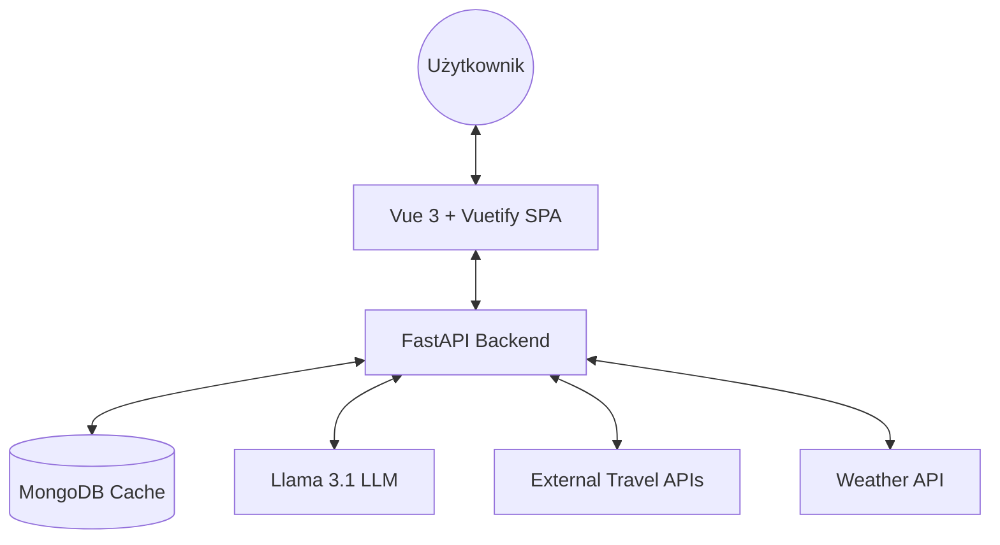
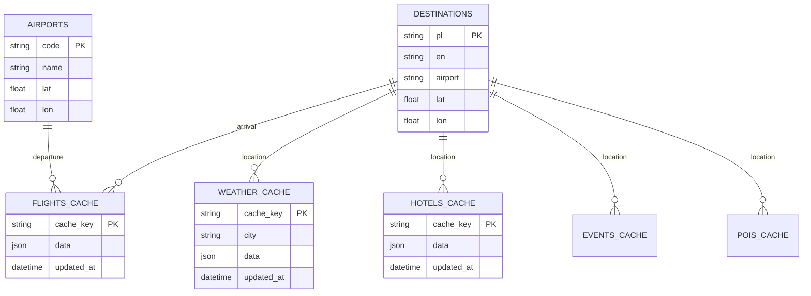

# 🌍 Smart Travel Planner AI
[](https://github.com/WukerDev/Smart-Travel-Planner/actions)

Nowoczesna aplikacja webowa do kompleksowego planowania podróży, wspierana przez lokalne modele wielkojęzyczne (LLM) oraz integrację z zewnętrznymi API turystycznymi.

---

## 🚀 Kluczowe Funkcjonalności
* **AI Itinerary Generator:** Generowanie spersonalizowanych planów zwiedzania (Llama 3.1 via Ollama).
* **Live Flight & Hotel Search:** Integracja z RapidAPI (Sky Scrapper & Booking.com).
* **Interactive Mapping:** Wizualizacja tras lotów i atrakcji (POI) przy użyciu OpenLayers.
* **Real-time Weather:** 5-dniowa prognoza pogody dla wybranej destynacji.
* **AI Travel Assistant:** Interaktywny czat z asystentem podróży działający w 100% lokalnie.
* **Modern UI/UX:** Responsywny interfejs z trybem Dark/Light mode i efektami szklanymi (Glassmorphism).

## 🛠 Stos Technologiczny
### Frontend
* **Vue 3** (Composition API) + **Vite**
* **Vuetify 3** (Material Design Component Library)
* **Pinia** (State Management)
* **OpenLayers** (Mapy wektorowe)

### Backend
* **FastAPI** (Python 3.11+)
* **MongoDB** + **Motor** (Asynchroniczny sterownik bazy danych)
* **Ollama** (Lokalne hostowanie modelu Llama 3.1)
* **Pytest** (Automatyczne testy jednostkowe i integracyjne)

### DevOps & Infrastructure
* **Docker & Docker Compose** (Konteneryzacja usług)
* **GitHub Actions** (Automatyczny pipeline CI/CD)
* **GHCR** (GitHub Container Registry dla obrazów Dockera)

## 🏗 Architektura Systemu i Środowisko
Aplikacja opiera się na klasycznej architekturze klient-serwer i jest w pełni konteneryzowana przy użyciu **Dockera**. Środowisko uruchomieniowe składa się z trzech głównych serwisów:

1. **Frontend (Vue 3 + Pinia):** Aplikacja SPA (Single Page Application). Głównym punktem wejścia interfejsu jest `App.vue`. Logika biznesowa po stronie klienta i komunikacja z API została zorganizowana w modularne store'y (Pinia).
2. **Backend (FastAPI):** Serwer REST API napisany w Pythonie (`main.py`). Pełni rolę warstwy pośredniczącej (BFF - Backend for Frontend) oraz orkiestratora. Zajmuje się logiką biznesową, komunikacją z zewnętrznymi API (np. pogodą, lotami), komunikacją z lokalnym modelem sztucznej inteligencji (Ollama) oraz bazą danych.
3. **Baza Danych (MongoDB):** Nierelacyjna baza danych wykorzystywana do przechowywania słowników (lotniska, dostępne destynacje) oraz cachowania zapytań zewnętrznych (np. wyników lotów, pogody), aby zminimalizować zużycie zewnętrznych limitów API.






## 🧠 Zarządzanie Stanem i Logika Frontendowa
Sercem logiki po stronie przeglądarki są moduły store zrealizowane w bibliotece **Pinia**. Oddzielają one warstwę wizualną od logiki pobierania danych. Główne moduły to:

* **`ai.ts`**: Zarządza interakcją ze sztuczną inteligencją. Obsługuje asystenta czatu w czasie rzeczywistym oraz generowanie szczegółowych, spersonalizowanych planów podróży (Itinerary).
* **`flights.ts` & `hotels.ts`**: Moduły odpowiedzialne za wyszukiwanie połączeń lotniczych oraz dostępnych obiektów noclegowych na podstawie wybranych dat i destynacji.
* **`weather.ts`**: Pobiera i przechowuje aktualną prognozę pogody dla wybranego miasta.
* **`extras.ts`**: Obsługuje pobieranie lokalnych atrakcji turystycznych (POI) oraz wydarzeń odbywających się w danym terminie.
* **`locations.ts`**: Zarządza słownikami systemowymi – przy uruchomieniu aplikacji pobiera listę obsługiwanych lotnisk oraz destynacji podróży.

## 🔌 Główne Endpointy API (Backend)
Backend w FastAPI (`main.py`) wystawia czytelne API dla frontendu. Niektóre z najważniejszych endpointów to:
* `POST /api/chat` - Komunikacja z asystentem podróży (LLM).
* `GET /api/itinerary` - Generowanie zarysu wycieczki przez AI.
* `GET /api/flights` & `GET /api/hotels` - Pobieranie danych o lotach i zakwaterowaniu (wspierane przez system cache'owania w MongoDB).
* `GET /api/weather/{city}` - Pobieranie danych pogodowych.
* `GET /api/airports` & `GET /api/destinations` - Endpointy zasilające słowniki na frontendzie.

*Uwaga: Przy starcie kontenera, backend automatycznie weryfikuje stan bazy danych i w razie potrzeby inicjalizuje ją danymi początkowymi z pliku `data.json`.*

## 🎨 Interfejs Użytkownika i Routing
Aplikacja została zaprojektowana z myślą o nowoczesnym wyglądzie i wygodzie użytkownika (UI/UX), wykorzystując wiodące technologie ekosystemu Vue:

* **Vuetify 3:** Cały interfejs opiera się na bibliotece komponentów Vuetify zintegrowanej za pomocą `vite-plugin-vuetify`, co pozwala na automatyczne importowanie (tree-shaking) i optymalizację rozmiaru paczki. Aplikacja wspiera nowoczesne trendy wizualne (m.in. Glassmorphism).
* **File-based Routing:** Zamiast ręcznej konfiguracji ścieżek, projekt używa biblioteki `unplugin-vue-router`. Trasy (routes) są generowane automatycznie na podstawie struktury plików wewnątrz katalogu z widokami (np. `src/pages`), co znacznie przyspiesza rozwój i utrzymanie porządku w kodzie. Głównym punktem wejścia renderującym widoki jest czysty i minimalistyczny komponent `App.vue`.
* **Interaktywne Mapy:** Do wizualizacji lokalizacji hoteli, atrakcji (POI) oraz zarysów tras wykorzystywana jest potężna biblioteka **OpenLayers** (`ol`).

## 🌍 Internacjonalizacja (Wielojęzyczność)
Aplikacja jest w pełni przystosowana do obsługi wielu języków dzięki bibliotece **Vue I18n** (działającej w trybie Composition API). 
* Obecnie wspierane są dwa języki: **Polski (`pl`)** oraz **Angielski (`en`)**.
* Tłumaczenia statyczne interfejsu (przyciski, zakładki, komunikaty w wyszukiwarce) przechowywane są w dedykowanych plikach `pl.json` oraz `en.json`.
* Dynamiczne dane (np. powitania asystenta AI, opisy destynacji) również reagują na zmianę języka – plik `destinations.json` przechowuje warianty opisów oraz głównych atrakcji dla każdego wspieranego języka (np. "Wieża Eiffla" vs "Eiffel Tower").

## 🚦 Szybki Start
Aby uruchomić projekt lokalnie, wymagany jest zainstalowany Docker oraz Ollama.

```bash
# 1. Sklonuj repozytorium
git clone [https://github.com/WukerDev/Smart-Travel-Planner.git](https://github.com/WukerDev/Smart-Travel-Planner.git)

# 2. Uruchom infrastrukturę
docker-compose up -d
